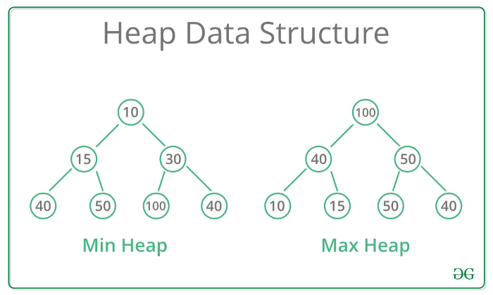
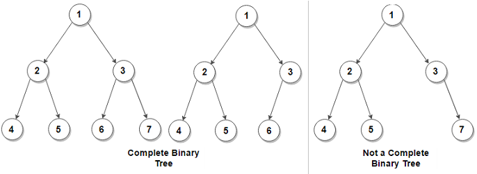
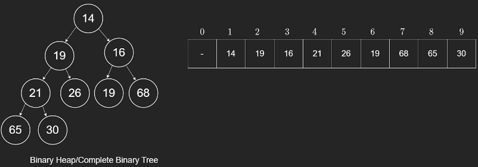
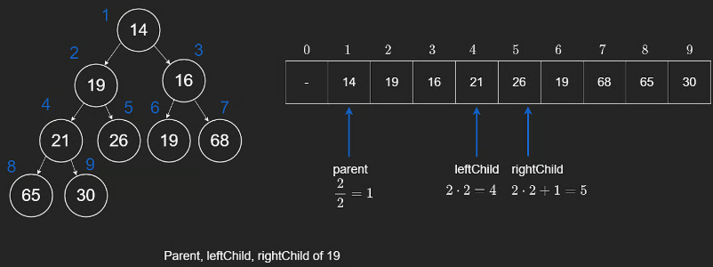
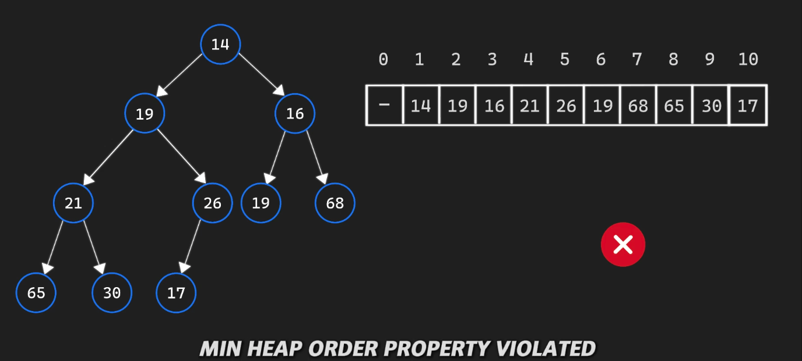
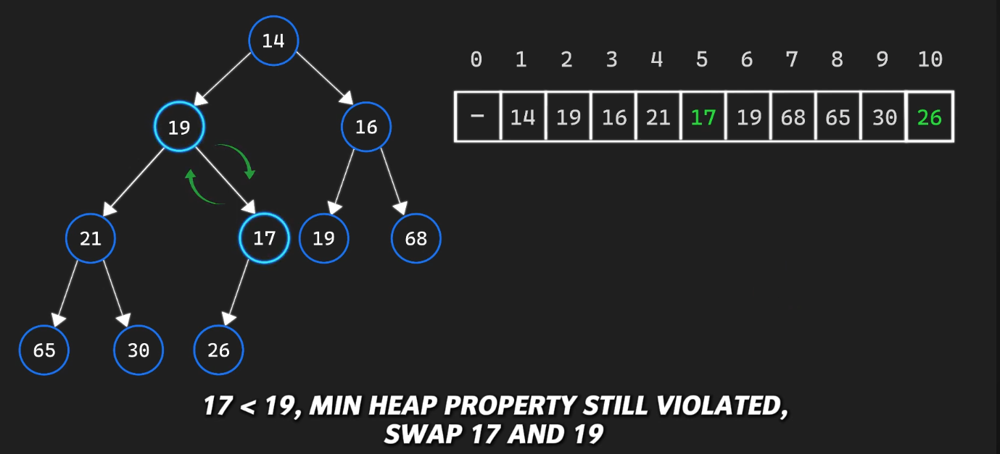
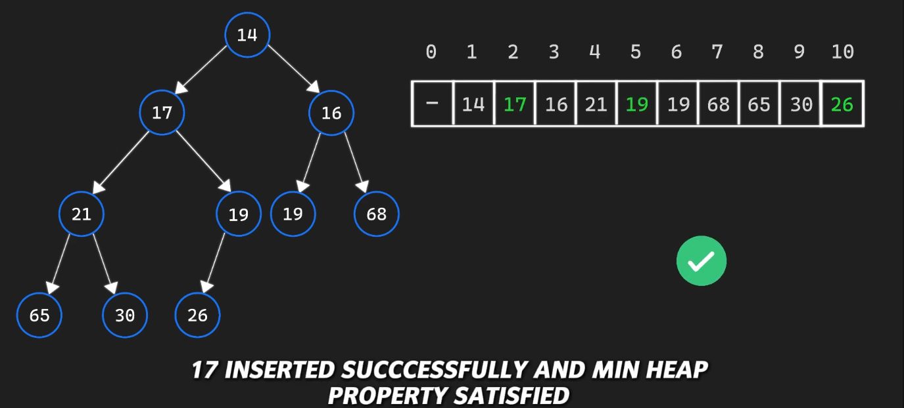
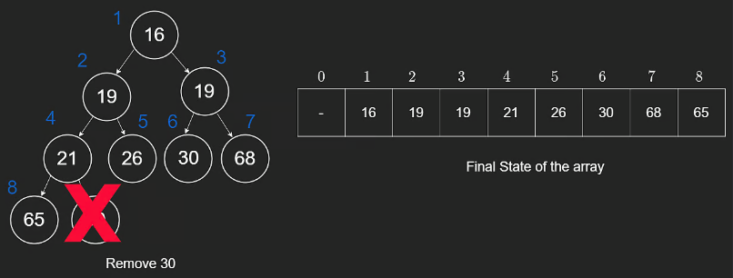

# Heap

## Problems

## Syntax
Python’s `heapq` module provides a Min-Heap by default. To use a Max-Heap, we must negate the numbers.

### Min-Heap (default)
```py
import heapq
heap = [] # Use a standard list
heapq.heappush(heap, 10) # O(log(n)) time
heapq.heappush(heap, 5)  # O(log(n)) time

smallest = heapq.heappop(heap) # Returns 5 | O(log(n)) time
peek = heap[0] # Returns 10 (without removing) | O(1) time
```

### Max-Heap (Negation trick)
```py
max_heap = []
heapq.heappush(max_heap, -10) # Push negative
heapq.heappush(max_heap, -20)

largest = -heapq.heappop(max_heap) # Pop and negate back (Returns 20)
```

### In-place Transformation:
```py
nums = [3, 1, 4]
heapq.heapify(nums) # O(N) time
```

## Heap Properties
> heap is also known as *priority queue*.

recall that queue's are first in, first out. However, if we wanted to queue based on a priority value, we could do that with a *priority queue*. The two types of priority are min and max. For example, in a min priority queue, we also pop the smallest number first.

Priority queue is the interface but under the hood, it's using a **binary heap** (however, the name's are interchangable)



At first glance, a heap looks like a binary tree. That's because it is haha. However, it's not the Binary Search Tree that we all know. The BST's root node is samller than every value to the right and bigger than every value of the left. This is not the case for heaps.

In fact, we can see in a min heap, that the decendant in the tree.

### 1) Structure property 
A binary heap is essentailly a Complete Binary Tree



#### Binary Tree Definition
1. Full Levels: Every level of the tree must be completely filled with nodes, except possibly the very last level.
2. Left Alignment: In that last level, all nodes must be as far to the left as possible. There can be no "gaps" between nodes from left to right.

### 2) Order property 
Recall the reason for having this min/max heap is for finding the minimum/maximum as fast. Therefore, in our min heap, it makes sense to have the smallest value at the root node. It will take O(1) time to lookup mini/maxi value.

So what order property should we give for it to do that? For every node, all the decendants **must** be greater than or equal to.

Binary heaps are drawn using a tree data structure but under the hood, they are implemented using arrays. Let's show how we can do this by using the given binary heap: `[null,14,19,16,21,26,19,68,65,30,null,null,null,null,null]`

We will take an array of size `n+1` where `n` is the number of nodes in our binary heap. This will make sense soon. We will visit our nodes in the same order as we visit nodes in breadth-first search (level by level, from left to right). We will insert these into our array in a contiguous fashion. However, we will start filling them from index 1 instead of 0, for reasons we will discuss soon.



The reason why we start filling up our array from index `1` is because it helps us figure out the index at which a node's left child, right child, or the parent resides. Because binary heaps are complete binary trees, no space is required for pointers. Instead, a node's left child, right child and parent can be calculated using the following formulas, where $i$ is the index of a given node.

- `leftChild` = $2*i$
- `rightChild` = $2*i+1$
- `parent` = $i/2$

---

Suppose we wanted to find the children and parent of the node with value `19`. The following visual demonstrates how using the formulas helps us figure them out.

The number above a node (in blue) is the corresponding index in the array of each node. It is important to note that these formulas only work when the tree is a complete binary tree and the array is filled contiguously from left to right.

We can also now appreciate why we start at index `1`. Suppose we wanted to find `14`'s left and right child and `14` was at `0` . Well, any number multiplied by a $0$ is $0$, and would tell us that the left child resides at the `0`th index, which is of course not the case.



## Push and Pop
### Pushing into the heap
Now let's talk about pushing into the heap (inserting into the heap)

Let's say that we're inserting into `17` into the heap:



Inserting `17` at where it is now, it passes the 1st properties, structure property. However, it violates the min heap order property since it's parent, `26` is strictly larger. Since `17` is at index 10, when we are coding, we'll know that the parent is at index 5 (`26`) because of the formula: `parent` = $i/2$.

We can fix the order property by simply swap the index `10` and index `5` in our array (values `17` and `26`). Now we continue the algorithm by checking if it's parent is greater. In this case, it's parent is at index `2` which has the value of `19`. Since `19 > 17`, we swap again.



After the swap, we can see that the heap passes both properties (structual and order)



#### Push Code
```py
class Heap:
    def __init__(self):
        self.heap = [0]

    def push(self, val):
        self.heap.append(val)
        i = len(self.heap) - 1

        # Percolate up
        while self.heap[i] < self.heap[i // 2]:
            tmp = self.heap[i]
            self.heap[i] = self.heap[i // 2]
            self.heap[i // 2] = tmp
            i = i // 2
```

Since we know the tree will always be balanced, the time complexity of the push operation is $O(\log n)$

### Popping from the heap
Recall that when we pop from a heap, we are removing the value with the highest priority.

Popping from a heap is more complicated than the push operation. One way that you might have already thought about is pop the root node and replace it with `min(left_child, right_child)`. The issue here is that while the order property is intact, we have violated the structure property.

Taking the tree from before, popping `14`, and swapping it with `16` - `min(left_child, right_child)` would require `19` to replace `16`. Now, level $2$ has a missing node i.e `19` is missing a left child.

The correct solution is very clever.
1. We read the root element since it is the element we wish to pop.
2. Next, we take the right-most node of the last level (last element in the array) and overide the root node with it.
3. We have now maintained the structure property, but the order property is violated.
4. To fix the order property, we have to make sure that `30` finds its place.
5. To do so, we will continuously swap `30` with `min(left_child, right_child)` until it reaches the correct position, i.e. both of its children are greater than or equal to `30`.
6. We swap `30` with `16`, then `19` with `30`. The resulting tree will look like the following.



#### Pop Code
```py
def pop(self):
    if len(self.heap) == 1:
        return None
    if len(self.heap) == 2:
        return self.heap.pop()

    res = self.heap[1]   
    # Move last value to root
    self.heap[1] = self.heap.pop()
    i = 1
    # Percolate down
    # Do we have a left child?
    while 2 * i < len(self.heap):
        # If our node has two children:
        # Do we have a right child?
        if (2 * i + 1 < len(self.heap) and 
        # Is the right child smaller than the left?
        self.heap[2 * i + 1] < self.heap[2 * i] and 
        # Is the parent bigger than the right child?
        self.heap[i] > self.heap[2 * i + 1]):
            # Swap right child
            tmp = self.heap[i]
            self.heap[i] = self.heap[2 * i + 1]
            self.heap[2 * i + 1] = tmp
            i = 2 * i + 1
        # If our node has one child
        # Is our node greater than our left child?
        elif self.heap[i] > self.heap[2 * i]:
            # Swap left child
            tmp = self.heap[i]
            self.heap[i] = self.heap[2 * i]
            self.heap[2 * i] = tmp
            i = 2 * i
        # If our node has no children

        else:
            break
    return res
```

The pseudocode shown above might seem daunting at first so let's go over it. If our `heap` is empty, there is nothing to pop, hence the `return null`. Our heap also could have just one node, in which case, we will just pop that node and don't need to make any adjustments. If the above two statements have not executed, it must be the case that we have children, meaning we need to perform a swap.

We store our `14` into a variable called `res` so that we don't lose it. Then we can replace `30` to be at the root node.

Our while loop runs as long as we have a left child and we determine this by making sure `2 * i` is not out of bounds. Then, there are three cases we concern ourselves with:

1. The node has no children
2. The node *only* has a left child
3. The node has two children

> When considering a binary heap, it is not possible to have only a right child because then it no longer is a complete binary tree and violates the structure property.

Because we are guaranteed to have a left child in the while loop, we need to now check if the node also has a right child, which we check by `2 * i + 1`. We also make sure that the current node is greater than its children because of the order property. We replace the node with the minimum of its two children.

If no right child exists and the current node's value is greater than its left child, we swap it with the left child.

If none of the above cases execute, then it must be the case that our node is in the proper position already, satisfying both the order and the structural property.

### Push and Pop Time complexity
The time complexity of the operations discussed so far can be summarized by the following table.

| Operation     | Big-O Time |
|---------------|------------|
| Get Min/Max   | $O(1)$     |
| Push          | $O(\log n)$|
| Pop           | $O(\log n)$|


